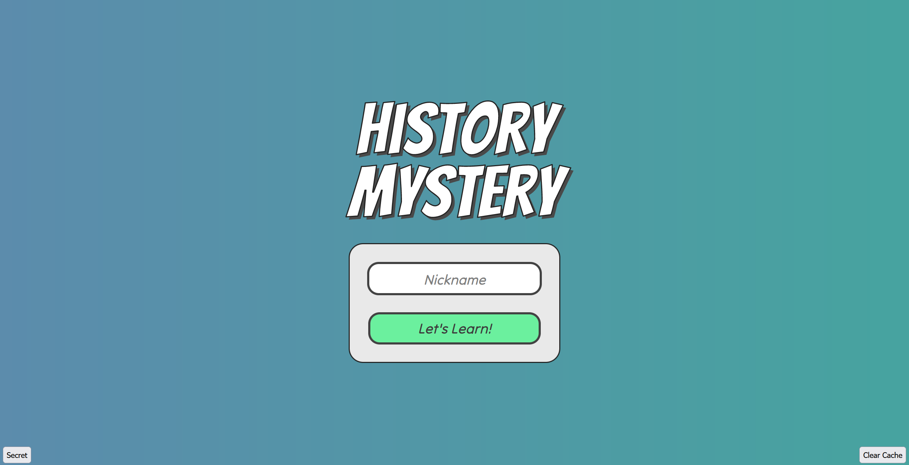
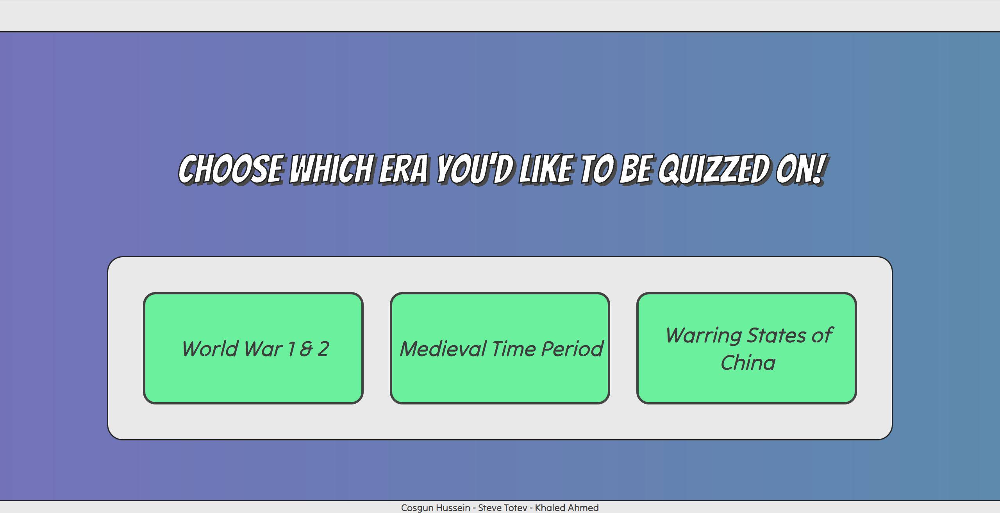
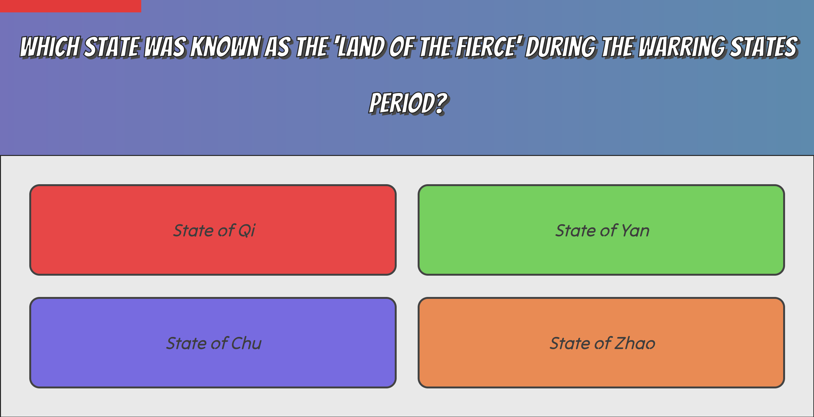
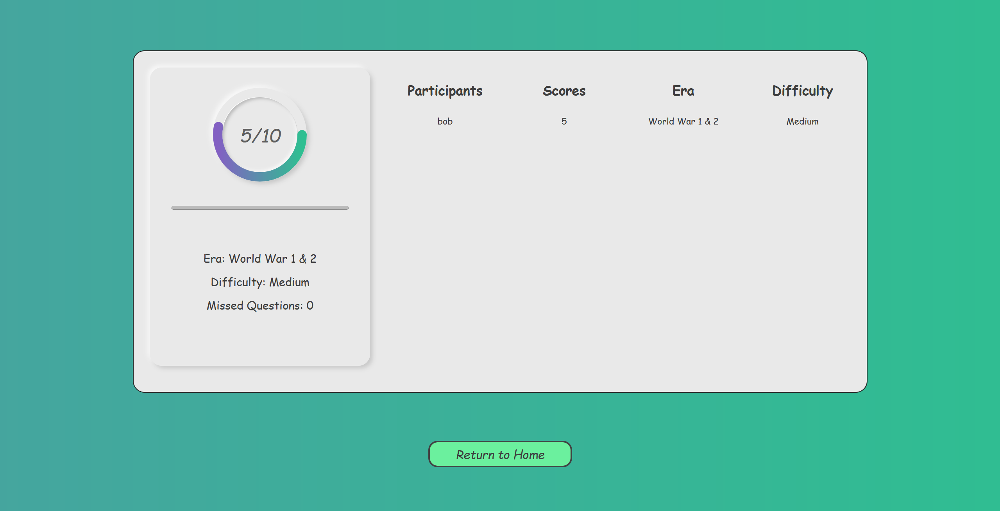

<!-- # HISTORY MYSTERY -->
## About
*Our school education system is failing us...*
There is a noticeable trend where students are lacking engagement in non-STEM subject.

*Which is why we are here!*
This repository contains our first project on making learning fun again. We
designed a text based quiz game that contains the fun element that will keep people engaged with learning more about history.

## Installation
 Inside backend/server you will need to create a .env file to specify the port
 
        PORT=3456
 Install the necessary dependecies and devDependecies to start the server
 
        cd backend
        cd server
        npm install
Now you can run the server

        npm run dev
 
## Technologies
- HTML/CSS/JavaScript
- Node.js (version: 8.19.2)

## Process

pending...

## License

pending...

## Preview...

## Contributions:

- Cosgun Hussein
- Steve Totev
- Sheikh Khaled Ahmed

## Future features

 - Development of game integration with Unreal Engine
 
